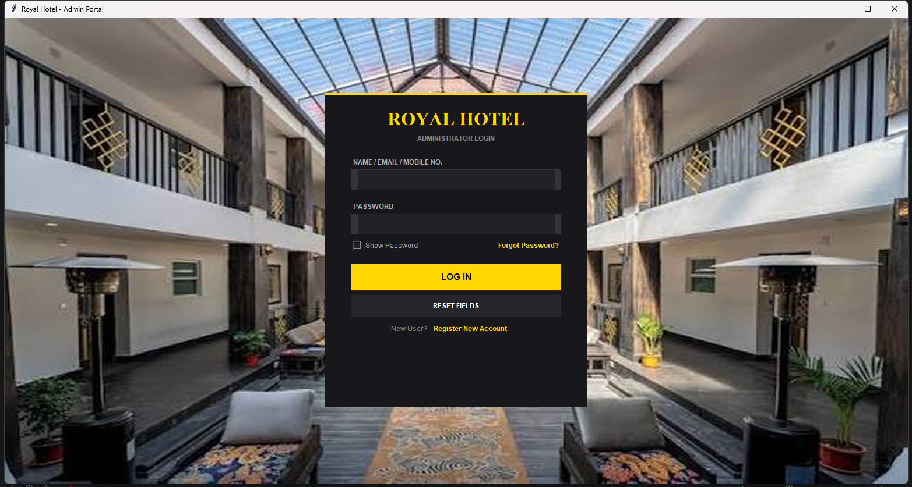
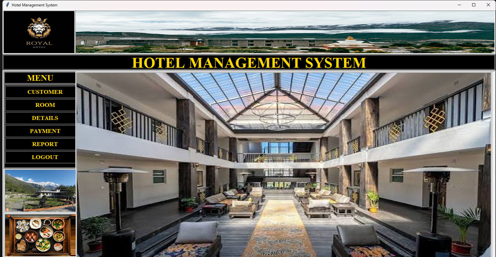
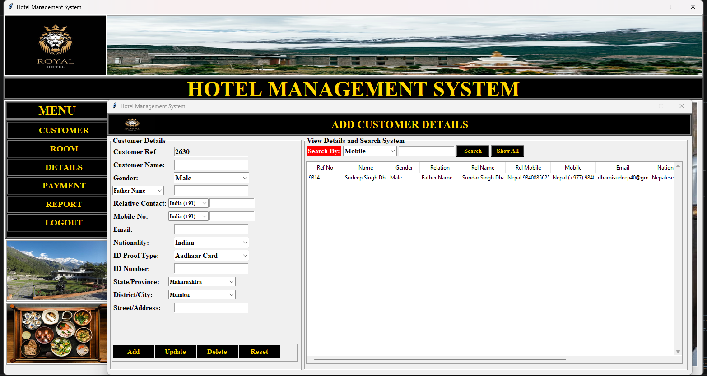
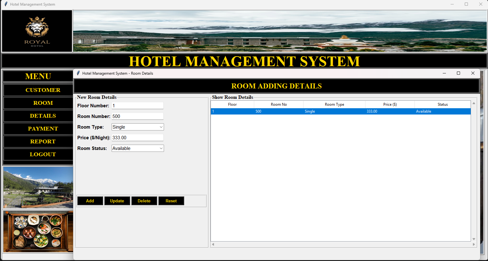
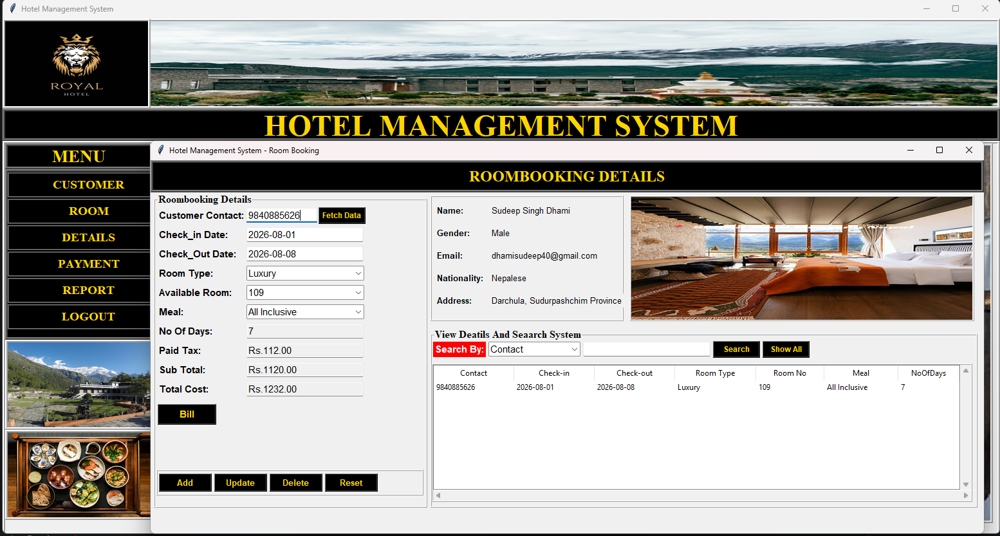
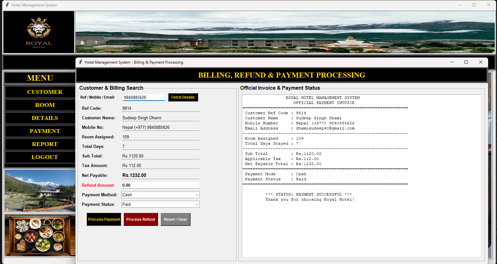
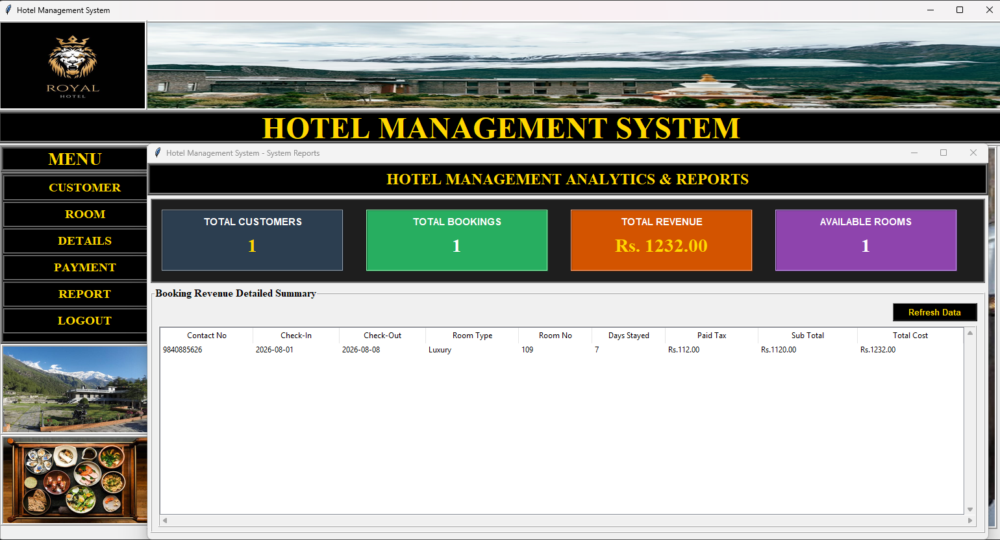
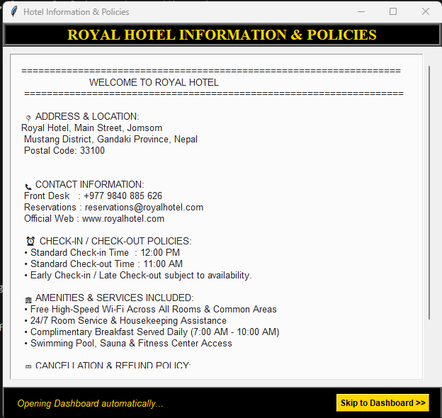
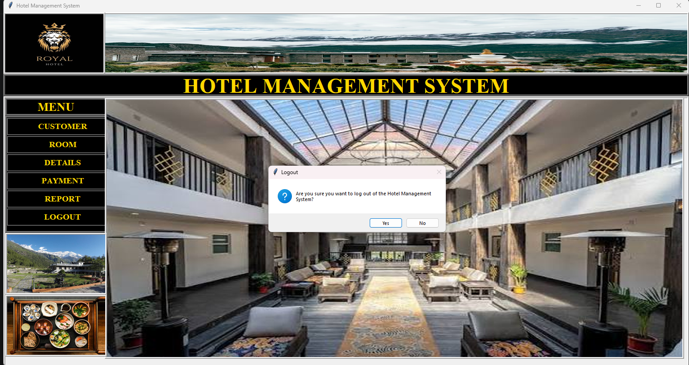

# 🏨 Hotel Management System

A desktop-based Hotel Management System developed using Python, Tkinter, and MySQL.

## 📌 Project Overview

This system helps manage hotel operations including rooms, customers, bookings, payments, and hotel records through a user-friendly desktop application.

## ✨ Features

- 🔐 User Login
- 🏨 Room Management
- 👤 Customer Management
- 📅 Booking Management
- 💳 Payment Management
- 📊 Dashboard
- 🔍 Search and Manage Records
- 🗄️ MySQL Database Integration

## 🛠️ Technologies Used

- Python
- Tkinter
- MySQL
- MySQL Connector
- Git & GitHub

## 📂 Project Structure

```text
hotel-management-system/
├── login.py
├── dashboard.py
├── hotel.py
├── customer.py
├── room.py
├── booking.py
├── payment.py
├── README.md
├── LICENSE
├── .gitignore
├── login.png
├── dashboard.png
├── customer-details.png
├── room-details.png
├── room-booking.png
├── billing.png
├── report.png
├── info.png
└── logout.png
## 📸 Screenshots

### 🔐 Login Page


### 📊 Dashboard


### 👤 Customer Details


### 🏨 Room Details


### 📅 Room Booking


### 💳 Billing


### 📄 Report


### ℹ️ Information


### 🚪 Logout

